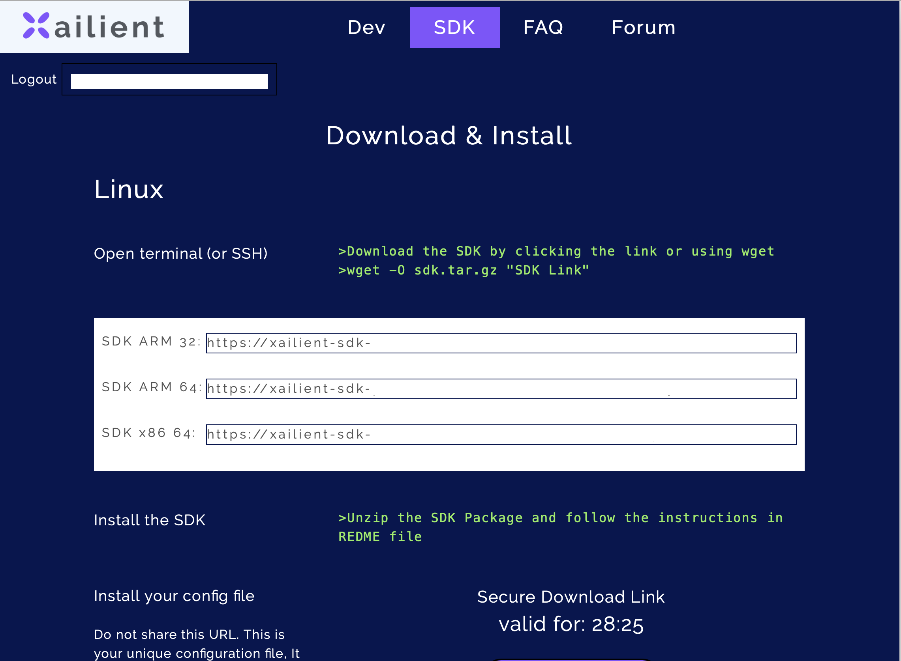
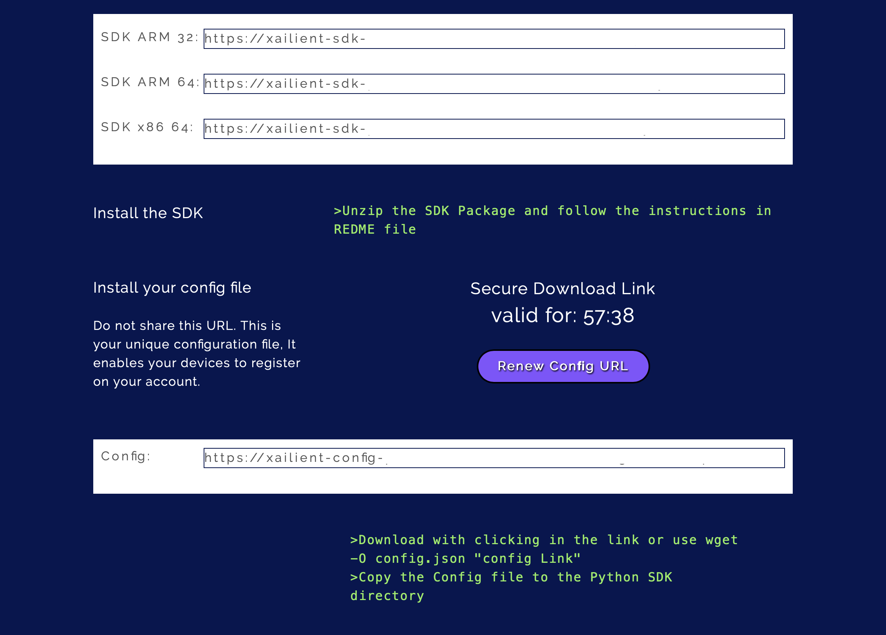

!!! error "DEPRECATED"
    [Xailient FaceSDK portal](https://sdk.xailient.com) will no longer be available from 17th July 2020 onwards. Please use [Xailient AI Console](https://console.xailient.com) instead to get the updated FaceDetector SDK and more detector models.
    This documentation is out-of-date and will no longer be maintained. [Visit our new documentation](https://xailient-docs.readthedocs.org).
    
# Supported Devices

* ARM x32: Raspberry Pi 3B+ (Other devices may work, but technical support is not guarenteed. Please contact at support@xailient.com if you face any issues.)
* ARM x64: Jetson Nano
* x86_64: Linux x86_64

## Arm x32

### Software pre-requisits

Note: This version of the Xailient Face Detector is supported on the following
platforms:

 - Raspberry Pi 3B+ with Raspbian Buster and Python 3.7.3

Other configurations may work, but technical support is not guaranteed. 

### PreRequisites:

Prerequisite installation is taken care in the Install.sh script. If any errors occur please take care of the 
package installation manually.

   This version of SDK supports only Python3.7. Please ensure that python3.7 is installed.

1. Install Python 3.7.3
Raspbian Buster comes with Python 3.7.3 preinstalled, so there is no need to explicitly install Python 3.7.3. To confirm, use the following command to see what version of Python is installed in your Raspberry Pi.
 
   <pre><code>python --version</code></pre>

2. Install tflite for Python 3.7
To install tflite for Python 3.7, enter following pip3 install command in your terminal.
 
   <pre><code>pip3 install https://dl.google.com/coral/python/tflite_runtime-1.14.0-cp37-cp37m-linux_armv7l.whl</code></pre>

3. Install OpenCV
Install OpenCV if it is not already installed. You can either use apt install or pip3 install OpenCV on your Raspberry Pi.
 
   <pre><code>sudo apt install -y python3-opencv</code></pre>
   or
   <pre><code>pip3 install opencv-python</code></pre>

### Download and launch the installation script

1. Download Xailient FaceSDK and Unzip
Go to Xailient SDK page and register as a new user and login.
 
   Go to SDK tab, where you will find instructions for downloading and installing Face SDK.

   

   For Raspberry Pi 3B+, download the ARM32 version of the SDK. You can either open the link from your Raspberry Pi’s browser to download it directly to it or you can use the following wget command:
 
   <pre><code>wget -O sdk.tar.gz "SDK Link"</code></pre>
   
   Unzip the downloaded FaceSDK.

2. Add Shared Library to Path

   This is required as the library depends on some dynamically loaded shared Libraries.
   
   <pre><code>export LD_LIBRARY_PATH=$LD_LIBRARY_PATH:$<Python_SDK path/Shared_arm32></code></pre>
   
   You can add library path to bashrc script so that you dont need to export everytime you login.
   
   <pre><code>echo “export LD_LIBRARY_PATH=$LD_LIBRABRY_PATH:$<pathofSDK>/Shared_arm32” >> .bashrc</code></pre>

3. Download config file

   
   
   From the Xailient SDK page, download the config file by either opening the link from your Raspberry Pi’s browser to or using the following wget command:
   
   <pre><code>wget -O config.json "Config Link"</code></pre>

   Copy the config.json file into the FaceSDK folder.

4. Install Xailient FaceSDK
   To install the Xailient FaceSDK, run the Install.shfile that is inside the SDK folder. Go to the FaceSDK folder from your terminal and run the following command: 
   
   <pre><code>./Install.sh</\pre></code></pre>
   
   For more details on the installation process, you can refer to the Readme file that comes along with the FaceSDK.
 
5. Run sample Face Detection code

   The FaceSDK comes with sample code that demonstrates how to use and
   interact with the Xailient Face Detector Python library.
   
   Go to samples folder and run the picam_streaming_demo.py script to run real-time face detection.
   
   You now have a real-time face detection running on a Raspberry Pi.

## Arm x64

### Software pre-requisits

Note: This version of the Xailient Face Detector is supported on the following
platforms:

 - Linux arm64 and Python 3.7.3

Other configurations may work, but technical support is not guaranteed.

### Prerequisite:

Installation of prerequisites is already taken care in Install.sh script. In case of any errors
please take care of installing the packages manually.

1. Install tflite for python3.7

   <pre><code>pip3 install https://dl.google.com/coral/python/tflite_runtime-1.14.0-cp37-cp37m-linux_aarch64.whl </code></pre>
2. Install opencv if not already installed.

   <pre><code>sudo apt-get install python3-opencv</code></pre>
   or
   <pre><code>pip3 install opencv-python</code></pre>
   
   Import cv2 from python3. If import is successful you are good to go.If not,
   install opencv from source following the link https://pysource.com/2019/08/26/install-opencv-4-1-on-nvidia-jetson-nano/
   add -D PYTHON_EXECUTABLE=/usr/bin/python3.7 to cmake.

### Download and launch the installation script

1. Download Xailient FaceSDK and Unzip
Go to Xailient SDK page and register as a new user and login.
 
   Go to SDK tab, where you will find instructions for downloading and installing Face SDK.

   

   Download the ARM64 version of the SDK using the following wget command:
   
   <pre><code>wget -O sdk.tar.gz "SDK Link"</code></pre>
   
   Unzip the downloaded FaceSDK.

2. Add Shared Library to Path as environement variable on the bash shell.

   This is required as the library depends on some dynamically loaded shared Libraries.
 
   <pre><code>export LD_LIBRARY_PATH=$LD_LIBRARY_PATH:<PathtoPythonSDK>/sharedLib_arm64</code></pre>

3. Download config file

   

   From the Xailient SDK page, download the config file by using the following wget command:
 
   <pre><code>wget -O config.json "Config Link"</code></pre>

   Copy the config.json file into the FaceSDK folder.

4. Install Xailient FaceSDK
To install the Xailient FaceSDK, run the Install.shfile that is inside the SDK folder. Go to the FaceSDK folder from your terminal and run the following command: 
 
   <pre><code>./Install.sh</code></pre>
 
   For more details on the installation process, you can refer to the Readme file that comes along with the FaceSDK.
 
5. Run sample Face Detection code

   The FaceSDK comes with sample code that demonstrates how to use and
   interact with the Xailient Face Detector Python library.
   
   Go to samples folder and run the basic_sample.py script to run real-time face detection.
 
## x86_64

### Software pre-requisits

Note: This version of the Xailient Face Detector is supported on the following
platforms:

 - Linux x86_64 and Python 3.7.3

Other configurations may work, but technical support is not guaranteed.

### Prerequisite:

Pre-Requisite installation(Steps 1 and 2) is taken care in the Install.sh script. In case of any errors,
please take cae of the manual intsallation of dependencies.

1. Install tflite for python3.7

   <pre><code>pip3 install https://dl.google.com/coral/python/tflite_runtime-1.14.0-cp37-cp37m-linux_x86_64.whl</code></pre>
   
2. Install opencv if not already installed.

   <pre><code>sudo apt-get install python3-opencv</code></pre>

   Import cv2 from python3. If import is successful you are good to go.If not,
   install opencv from source following the link https://pysource.com/2019/08/26/install-opencv-4-1-on-nvidia-jetson-nano/
   add -D PYTHON_EXECUTABLE=/usr/bin/python3.7 to cmake.

### Download and launch the installation script

1. Download Xailient FaceSDK and Unzip
Go to Xailient SDK page and register as a new user and login.
 
   Go to SDK tab, where you will find instructions for downloading and installing Face SDK.

   

   For Linux x86_64, download the x86_64 version of the SDK. You can use the following wget command:
   
   <pre><code>wget -O sdk.tar.gz "SDK Link"</code></pre>
   
   Unzip the downloaded FaceSDK.

2. Add Shared Library to Path as environement variable on the bash shell.

   This is required as the library depends on some dynamically loaded shared Libraries.
   
      <pre><code>export LD_LIBRARY_PATH=$LD_LIBRARY_PATH:<PathtoPythonSDK>/sharedLib_x86_64</code></pre>
   
   Add this line in bashrc to avoid configuring everytime you login using shell.

3. Download config file

   

   From the Xailient SDK page, download the config file by using the following wget command:
   
   <pre><code>wget -O config.json "Config Link"</code></pre>

   Copy the config.json file into the FaceSDK folder.

4. Install Xailient FaceSDK
To install the Xailient FaceSDK, run the Install.shfile that is inside the SDK folder. Go to the FaceSDK folder from your terminal and run the following command: 
 
   <pre><code>./Install.sh</code></pre>
   
   For more details on the installation process, you can refer to the Readme file that comes along with the FaceSDK.
 
5. Run sample Face Detection code

   The FaceSDK comes with sample code that demonstrates how to use and
   interact with the Xailient Face Detector Python library.
   
   Go to samples folder and run the basic_sample.py script to run real-time face detection.